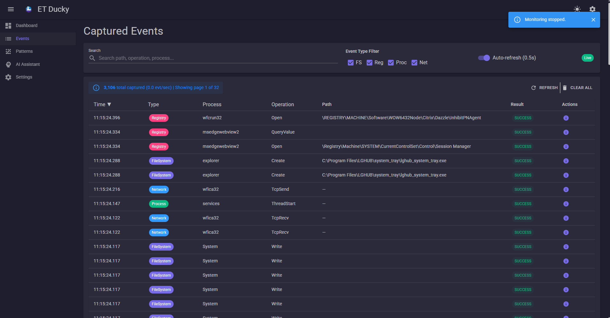
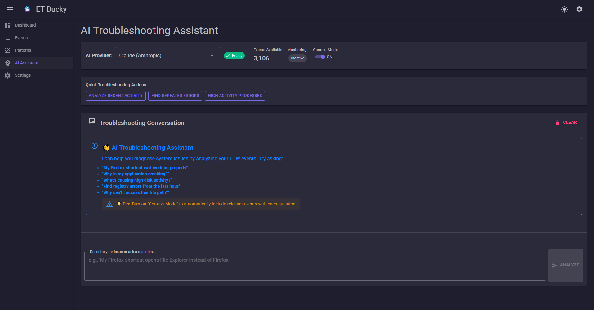
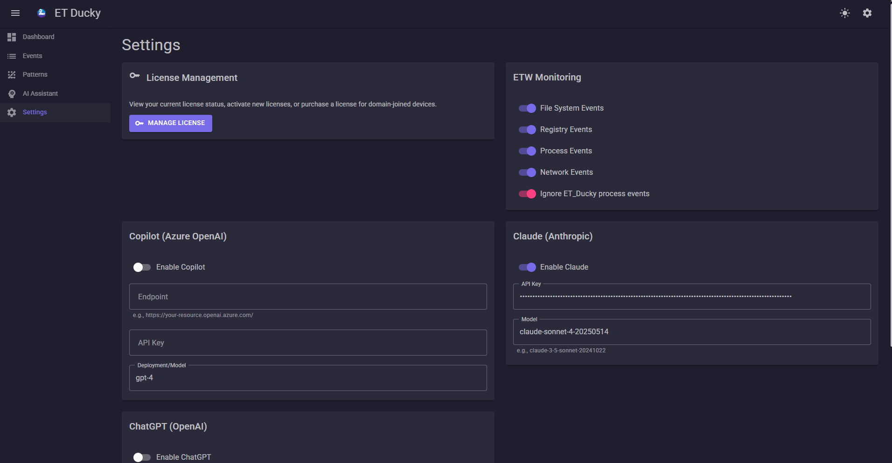

# ET_Ducky-Desktop

ET_Ducky-Desktop is a Windows diagnostic and troubleshooting application built on top of Event Tracing for Windows (ETW).  
It provides real-time visibility into system behavior including file activity, registry writes, process launches, and more — all presented in a clear and searchable UI.

The application is designed for power users, system administrators, developers, SOC/IR roles, and anyone who needs deeper visibility into what their system is doing.

## Key Capabilities

### Real-Time System Activity
- File reads/writes, creations, and deletions  
- Registry modifications  
- Process starts and exits  
- Network events (provider-dependent)  
- Filtering, searching, grouping, and event expansion  

### Diagnostics and Analysis
- Disk space usage diagnostic  
- Large file scan  
- Additional checks where supported  
- Optional AI-based analysis (configurable)

### Log History and Event Correlation
- View recent events  
- Expand individual events to inspect details  
- Correlate diagnostics with captured activity  

### Privacy and Local Control
- All analysis and event data stays on the device  
- Settings are stored locally per user  
- No external telemetry

## Why Use ET_Ducky-Desktop?

Windows hides most internal activity from plain view. ET_Ducky provides:

- Insight into unexpected file or registry writes  
- Visibility into what processes are doing  
- Faster troubleshooting of slowdowns or unexplained behavior  
- A developer-friendly way to observe how an application interacts with the OS  
- A compact alternative to ProcMon for targeted tracing  
- Powerful diagnostic tools built directly into the UI  

If you need to know **what happened**, **when**, and **why**, ETW Monitor makes that observable.

## Screenshots (placeholders)


 



## Installation

### Download the MSI Installer
Visit the Releases page and download the latest `.msi` installer.

## Usage Guide

### Dashboard
Displays summary information, recent activity categories, and system overview.

### Events Panel
Shows real-time ETW events.  
You can filter, search, expand events, and pause/resume capture.

### Diagnostics
Includes tools such as:

- Free disk space check  
- Large file scan  

Diagnostic results feed into insights.

### Assistant
The assistant can analyze event history, summarize activity, and interpret diagnostics.

### Settings

#### Monitoring
- Enable or disable ETW providers  
- Configure event buffer size  
- Skip self-generated events  

#### Analysis
- Select analysis provider  
- Enable insights  
- Control number of events analyzed  

#### Diagnostics
- Enable or disable modules  
- Configure thresholds  

#### Licensing
- Enter license key  
- View license status  

Settings are stored in:

```
%LOCALAPPDATA%/ETWMonitor/
```

## Project Structure

```
ETWMonitor_Desktop/   # MAUI UI
ETWMonitor_Core/      # ETW engine and logic
```

## Building From Source

### Requirements
- Visual Studio 2022  
- .NET 9 SDK  
- Windows 10/11  
- WebView2 runtime  

### Steps

```bash
git clone https://github.com/trucule/ET_Ducky-Desktop.git
cd ET_Ducky-Desktop
```

Open:

```
ET_Ducky-Desktop-Public.sln
```

Set the startup project to:

```
ETWMonitor_Desktop
```

Build with:

```bash
dotnet build --configuration Debug
```

Run with:

```bash
dotnet run --project ETWMonitor_Desktop
```

## Publishing

```bash
dotnet publish ETWMonitor_Desktop.csproj ^
  -c Release ^
  -f net9.0-windows10.0.19041.0 ^
  -r win-x64 ^
  --self-contained true ^
  /p:IncludeNativeLibrariesForSelfContained=true ^
  /p:PublishSingleFile=false ^
  /p:PublishTrimmed=false
```

## Contributing

Contributions are welcome for:

- ETW provider improvements  
- Diagnostics  
- UI fixes  
- Documentation  

## License

This repository excludes proprietary licensing systems and private keys.  
All included code is available under the project's LICENSE file.
